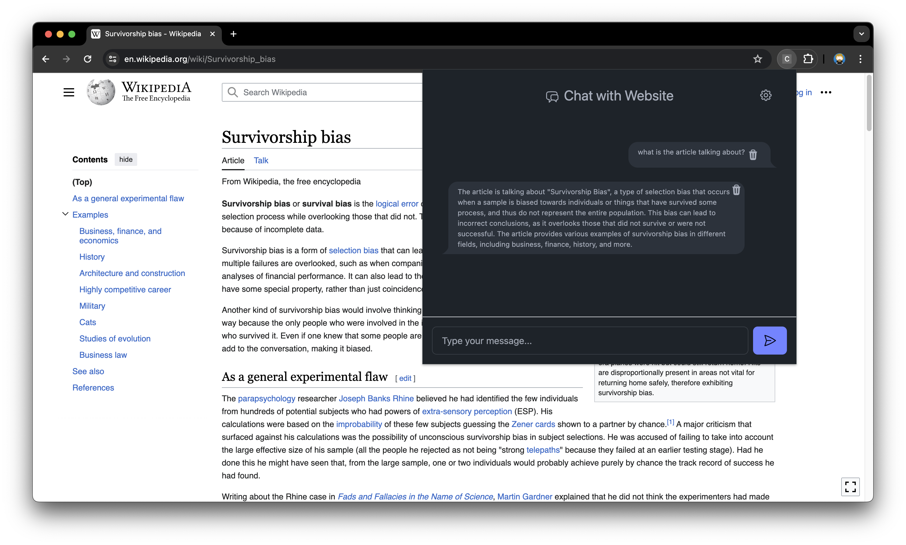

# Cosurfer

## Introduction

Cosurfer is a browser extension (currently only for [Chromium based browsers](<https://en.wikipedia.org/wiki/Chromium_(web_browser)#Browsers_based_on_Chromium>)), that lets you ask questions to the website in your current browser tab using [LLM](https://en.wikipedia.org/wiki/Large_language_model)s (currently only via [groq](https://groq.com/)). It can summarize long discussions for you for example.

## Installation

- Take the `dist` folder of this repository OR build it yourself
- Go to `chrome://extensions`
- Click "Load unpacked"
- Select the `dist` folder

## Setup

- Create an account at [groq](https://groq.com/)
- Generate an [API key](https://console.groq.com/keys)
- Open the Cosurfer settings by clicking the gear icon
- Insert the groq API key

## Tech Stack

- [React](https://github.com/facebook/react)
- [LangChain.js](https://github.com/langchain-ai/langchainjs)
- [daisyUI](https://daisyui.com/)
  - might migrate to https://github.com/daisyui/react-daisyui
- [heroicons](https://heroicons.com/)

## Limitations

- Currently the [innerText](https://developer.mozilla.org/en-US/docs/Web/API/HTMLElement/innerText) of the website's body element is sent to the LLM. If there is too much text, the context length is exceeded and the request fails silently (TODO: fix)

## Development

- `npm install`
- `npm run build`
- `npm run watch`
